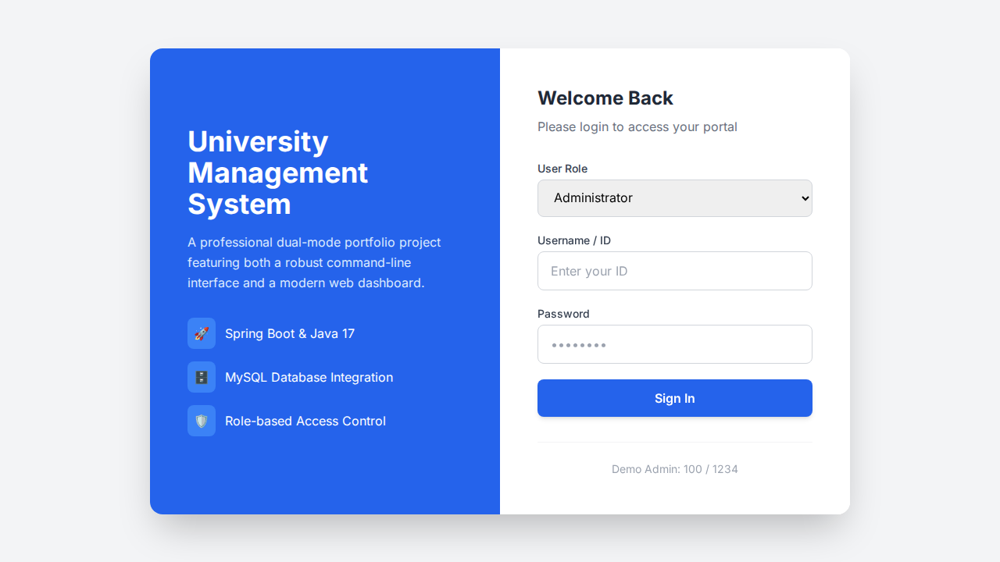
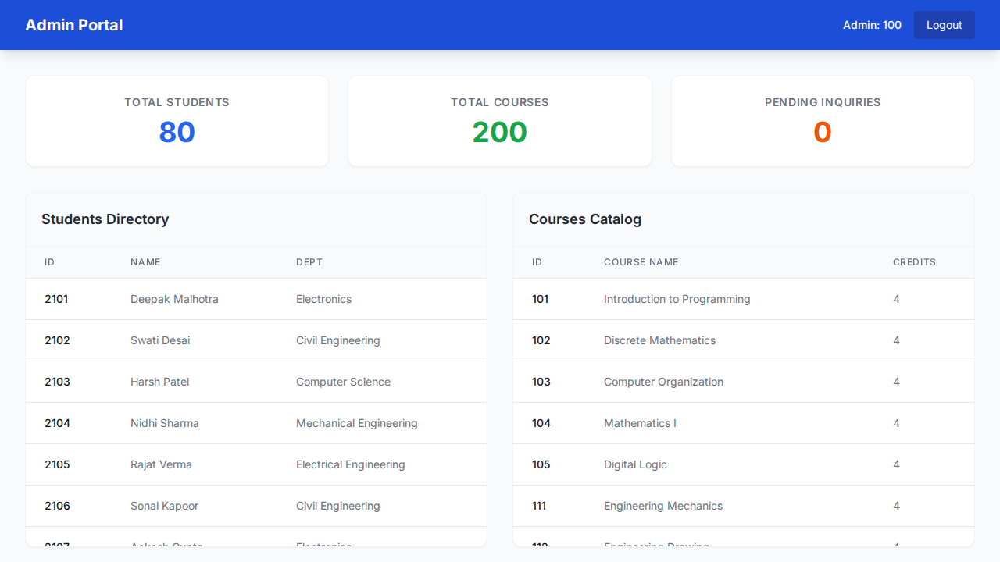
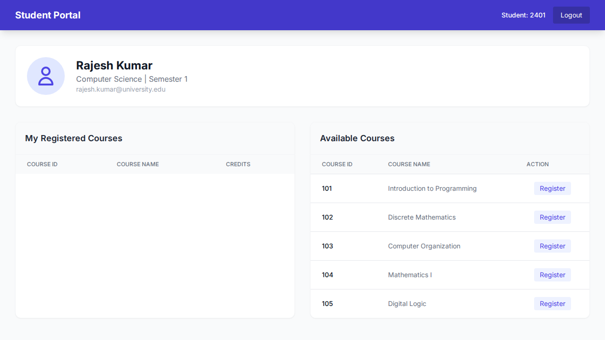
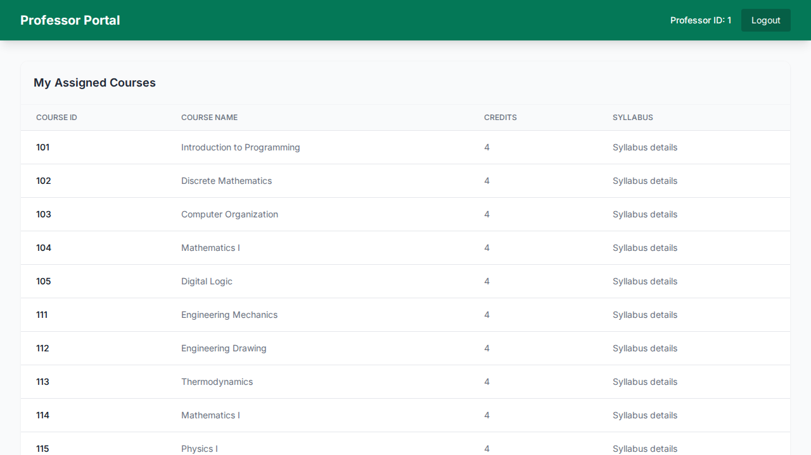
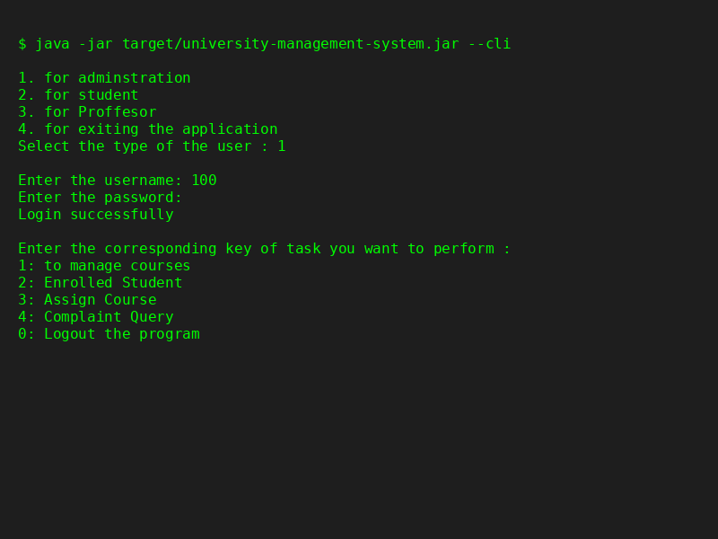

# University Management System

A robust dual-mode (CLI + Web) University Management System written in Java and powered by Spring Boot. This application simulates a core academic portal handling distinct roles for **Administrators**, **Professors**, and **Students**. It is powered by a relational MySQL database via JDBC and Spring Data JdbcTemplate.

## 🚀 Live Demo
*(Insert Live URL Here after deployment)*

## Features

- **Admin Module**:
  - Manage (Add, Delete, View) university courses.
  - Manage student records (Add, Update, Delete).
  - Assign courses to professors.
  - View and resolve student inquiries.
- **Professor Module**:
  - View assigned courses, schedules, and enrolled students.
  - Update course details (timing, credits, prerequisites, syllabus).
- **Student Module**:
  - View personal information and registered courses.
  - Register for or drop courses.
  - View available courses by department and semester.
  - Check semester grades and cumulative GPA.
  - Submit academic inquiries to administrators.

## Screenshots

### Login / Overview


### Admin Dashboard


### Student Dashboard


### Professor Dashboard


### CLI Application


## Tech Stack
- **Backend:** Java 17, Spring Boot, Spring Web, Spring JDBC
- **Frontend:** HTML5, Tailwind CSS, Vanilla JS
- **Database:** MySQL 8.x
- **Build/Container:** Maven, Docker

## Architecture
This project features a clean dual-mode architecture:
1. **Web Mode:** A Spring Boot REST API serving a modern Single Page Application (SPA) dashboard.
2. **CLI Mode:** The original interactive Command Line Interface, fully preserved and accessible via a `--cli` flag.

## Local Setup

### 1. Database Configuration
Create a `.env` file in the root directory based on `.env.example`:
```env
DB_URL=jdbc:mysql://localhost:3306/assignment8
DB_USERNAME=root
DB_PASSWORD=your_password
PORT=8080
```
Import the `database/Java_assignment.sql` file into your MySQL database to build the schema.

### 2. Running Web Mode
Compile and run the Spring Boot application:
```bash
JAVA_HOME=/usr/lib/jvm/java-17-openjdk-amd64 mvn clean package -DskipTests
java -jar target/university-management-system-1.0-SNAPSHOT.jar
```
Visit `http://localhost:8080` in your browser.

### 3. Running CLI Mode
Append the `--cli` flag to disable the web server and launch the terminal interface:
```bash
java -jar target/university-management-system-1.0-SNAPSHOT.jar --cli
```

## Docker Setup
Build and run the multi-stage Docker container locally:
```bash
docker build -t university-management .
docker run -p 8080:8080 -e DB_URL="jdbc:mysql://host.docker.internal:3306/assignment8" -e DB_USERNAME="root" -e DB_PASSWORD="password" university-management
```

## Security Notes
- Environment variables (`.env`) are explicitly ignored in `.gitignore` and `.dockerignore`.
- Source code contains no hardcoded production secrets.
- Uses `JdbcTemplate` prepared statements to prevent SQL injection in the web layer.

## Deployment

This application is **Docker-ready** and designed to be deployed to free hosting services such as **Render**. 

**Preferred Architecture:**
GitHub repository ➔ Render Web Service (Docker) ➔ Clever Cloud (Free MySQL Add-on).

*Note: Render requires applications to bind to `0.0.0.0` and read the `PORT` dynamically, which is natively supported in this project's Spring Boot configuration.*

## Project Structure
- `src/main/java/com/university/management/`
  - `controller/`: REST APIs for the web layer.
  - `cli/`: Legacy logic and DAO structure for terminal interactions.
- `src/main/resources/static/`: Frontend HTML, CSS, and JS.
- `database/`: SQL schema dumps.
